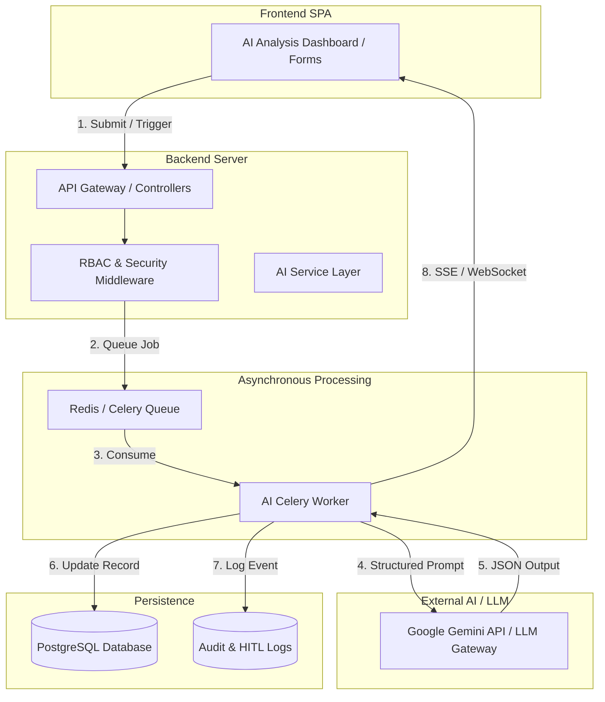
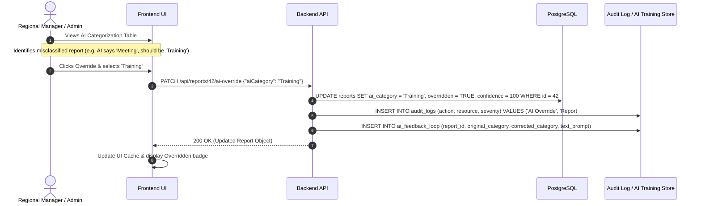
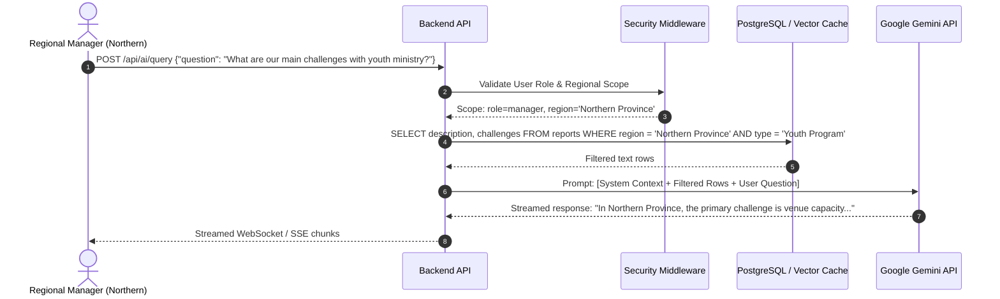
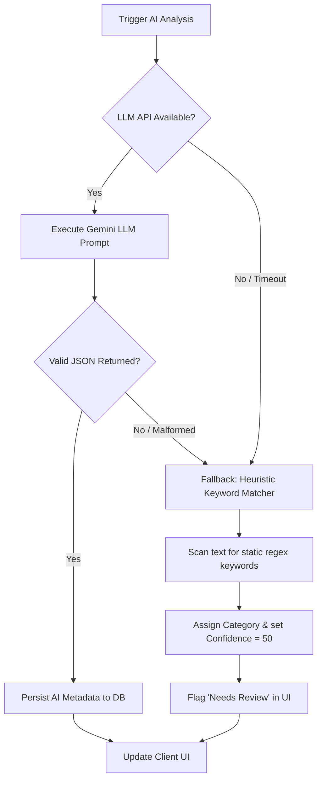

# SU Connect — AI Subsystem Architecture Specification

This document provides a comprehensive technical specification for the **AI Subsystem** within the **SU Connect** (Scripture Union Rwanda) platform. It details how artificial intelligence (specifically Large Language Models like Google Gemini) integrates into the backend architecture to automate report analysis, detect organizational trends, facilitate human-in-the-loop (HITL) overrides, and deliver role-restricted operational intelligence.

---

## 1. Executive Summary & System Architecture

The SU Connect AI Subsystem acts as an intelligent operational intelligence layer sitting above the primary relational database (PostgreSQL) and backend application server (e.g., Python/Django or Node.js/NestJS). 

Instead of relying solely on manual administrative review, the AI Subsystem asynchronously processes unstructured qualitative data (report descriptions, participant outcomes, challenges, prayer needs) to generate structured, searchable metadata, executive summaries, and predictive alerts.



---
---

## 2. Core AI Capabilities & Workflows

### 2.1 Automated Report Analysis & Categorization
When a staff member or field coordinator submits an activity report (`POST /api/reports`), the qualitative text often contains rich, unstructured narrative details. The AI Subsystem automatically ingests this narrative to evaluate and enrich the record.

*   **Trigger**: Asynchronous post-save hook on the `reports` table or manual trigger via `POST /api/reports/ai-analyze`.
*   **Execution**: The backend dispatches a background worker job containing the report's `title`, `description`, `outcomes`, `challenges`, and `prayerRequests`.
*   **LLM Processing**: The LLM is prompted with a strict system instruction and few-shot examples to evaluate the text against SU Connect's official domain taxonomies.
*   **Structured Output**: The AI returns a validated JSON object conforming to the following schema:
    ```json
    {
      "$schema": "http://json-schema.org/draft-07/schema#",
      "type": "object",
      "properties": {
        "aiCategory": {
          "type": "string",
          "enum": ["Outreach", "Bible Study", "Training", "Meeting", "Community Event", "Prayer Meeting", "Youth Program"]
        },
        "confidence": { "type": "integer", "minimum": 0, "maximum": 100 },
        "keywords": { "type": "array", "items": { "type": "string" }, "maxItems": 5 },
        "aiSummary": { "type": "string", "maxLength": 300 }
      },
      "required": ["aiCategory", "confidence", "keywords", "aiSummary"]
    }
    ```
*   **Database Persistence**: The worker populates the `reports` table columns (`ai_category`, `confidence`, `keywords`, `ai_summary`) and sets `overridden = false`.

---

### 2.2 Human-in-the-Loop (HITL) Manual Overrides
AI classifications are treated as recommendations rather than immutable truth. To maintain absolute data integrity and create a continuous reinforcement learning feedback loop, SU Connect implements an explicit HITL override workflow.



**AI Retraining / Prompt Improvement**: The records stored in `ai_feedback_loop` are periodically reviewed by system administrators. High-quality corrected examples are dynamically injected into the LLM system prompt as few-shot exemplars to prevent the AI from repeating identical misclassifications in future reports.

---

### 2.3 Trend Detection & Predictive Insights
Beyond individual report analysis, the AI Subsystem functions as an executive macro-analysis tool accessible via the `AIAnalysisDashboard.jsx`.

*   **Trigger**: Scheduled cron job (e.g., weekly/monthly at midnight) or on-demand execution by administrators.
*   **Data Aggregation**: The background worker queries aggregated statistics, participant counts, regional distributions, and concatenated summaries of recent challenges and outcomes from the database.
*   **Analytical Prompting**: The LLM is instructed to act as an expert organizational data analyst. It evaluates the aggregated multi-region data to identify statistical anomalies, emerging themes, and resource bottlenecks.
*   **Output Generation**: The AI generates structured `THEMES` and actionable `INSIGHTS` categorized by severity:
    *   **Positive (`success`)**: E.g., *"Youth participation in Western Province has surged by 34% following the introduction of sports ministry."*
    *   **Warning (`warning`)**: E.g., *"Northern Province exhibits a 60% increase in requests for Bible study materials. Recommend immediate Q3 budget reallocation."*
    *   **Operational Alert (`info`)**: E.g., *"Prayer request volume regarding field staff safety has increased by 28% in Eastern Province."*

---

### 2.4 Consolidated Report Summarization
During regional consolidation (`ConsolidationDashboard.jsx`), administrators frequently need to merge dozens of individual activity reports into a single cohesive executive document for board members or external donors.

*   **Process**: When a user selects a period (e.g., `Monthly`) and region (e.g., `All Regions`), the backend fetches all approved reports within that timeframe.
*   **LLM Synthesis**: The AI receives a structured prompt containing the concatenated `aiSummary` and `outcomes` of all matching reports.
*   **Document Generation**: The AI synthesizes the data into a formal, highly polished executive summary adhering to professional institutional tone. It highlights cumulative participant reach, primary ministry achievements, and overarching regional challenges, ready for one-click Word/PDF export.

---

### 2.5 Operational AI Chat Assistant (Role-Restricted)
To enable conversational business intelligence, SU Connect provides an interactive AI query interface where users can ask natural language questions about ministry operations.



**Crucial Security Guardrail**: The AI service **never** has direct, unfiltered access to the database. All context provided to the LLM is pre-filtered by the backend's RBAC middleware. Therefore, if a Northern Province manager asks the AI assistant about financial challenges, the backend only provides historical records from the Northern Province, guaranteeing that the LLM cannot hallucinate or leak sensitive data from Kigali or other regions.

---
---

## 3. Backend Integration & Data Flow

### 3.1 Asynchronous Queue Architecture (Celery + Redis)
Because LLM API calls can introduce variable latency (ranging from 1 to 5 seconds), AI analysis must never execute synchronously within the main HTTP request-response thread.

```python
# Example Conceptual Implementation (Python / Celery)
from celery import shared_task
from app.models import Report
from app.services.llm import GeminiClient
from app.services.websockets import push_event

@shared_task(bind=True, max_retries=3)
def execute_report_ai_analysis(self, report_id: int):
    try:
        report = Report.objects.get(id=report_id)
        llm_client = GeminiClient()
        
        # Notify frontend that analysis has started
        push_event(report.submitted_by_id, "ai_status", {"report_id": report.id, "status": "analyzing", "progress": 25})
        
        prompt = llm_client.build_classification_prompt(report)
        structured_result = llm_client.generate_structured_json(prompt)
        
        # Update database record
        report.ai_category = structured_result['aiCategory']
        report.confidence = structured_result['confidence']
        report.keywords = structured_result['keywords']
        report.ai_summary = structured_result['aiSummary']
        report.overridden = False
        report.save()
        
        # Notify frontend of completion
        push_event(report.submitted_by_id, "ai_status", {"report_id": report.id, "status": "complete", "progress": 100, "data": structured_result})
        
    except Exception as exc:
        # Retry exponentially on API timeout or rate limit
        push_event(report.submitted_by_id, "ai_status", {"report_id": report.id, "status": "error", "message": str(exc)})
        raise self.retry(exc=exc, countdown=2 ** self.request.retries)
```

---
---

## 4. Prompt Engineering & Structured Outputs

### 4.1 System Prompt Design
To ensure deterministic, high-quality results from the LLM, SU Connect utilizes advanced prompt engineering techniques including persona definition, explicit constraint framing, and schema enforcement.

```text
[[SYSTEM INSTRUCTION]]
You are an expert AI operational analyst for Scripture Union Rwanda (SU Connect). Your task is to analyze qualitative ministry activity reports and extract structured metadata.

[[DOMAIN TAXONOMY]]
Allowed Categories: ["Outreach", "Bible Study", "Training", "Meeting", "Community Event", "Prayer Meeting", "Youth Program"]

[[RULES & CONSTRAINTS]]
1. You MUST analyze the provided Title, Description, Outcomes, and Challenges.
2. Classify the activity into EXACTLY ONE of the Allowed Categories.
3. Assign a confidence score between 0 and 100 based on how explicitly the text matches the category definition.
4. Extract exactly 3 to 5 single-word or two-word lowercase keywords reflecting the core themes (e.g., "youth", "discipleship", "kigali").
5. Write a concise executive summary (maximum 3 sentences) highlighting the participant reach and primary outcome.
6. You MUST respond ONLY with a valid JSON object matching the requested JSON schema. Do NOT wrap the JSON in markdown code blocks or include introductory text.
```

### 4.2 Hallucination Mitigation Strategies
1.  **Temperature Parameter**: All LLM API invocations are configured with `temperature = 0.0` to force deterministic, highest-probability token selection and eliminate creative extrapolation.
2.  **Strict Schema Parsing**: The backend validates all LLM outputs using strict schema parsing libraries (e.g., Pydantic in Python or Zod in TypeScript). If the LLM returns malformed JSON or hallucinates an unsupported category, the parser catches the error and triggers an automatic retry with a correction prompt.
3.  **Context Bounding**: The LLM is explicitly instructed: *"If the provided text is vague or insufficient to determine a category, assign the category 'Community Event', set confidence to 50, and state 'Insufficient details provided' in the summary."*

---
---

## 5. Security, Privacy & RBAC Guardrails

### 5.1 PII Scrubbing & Data Masking
Before sending unstructured report descriptions or support justifications to external LLM APIs (such as Google Gemini), the backend AI service layer executes a regex-based sanitization pass to strip sensitive Personal Identifiable Information (PII):
*   **Phone Numbers**: Matches and replaces Rwandan phone patterns (`+250...`, `078...`) with `[PHONE_REDACTED]`.
*   **Email Addresses**: Replaces email strings with `[EMAIL_REDACTED]`.
*   **Specific Names**: Where applicable, cross-references against participant lists to anonymize vulnerable individuals.

### 5.2 Enterprise Data Privacy Compliance
SU Connect enforces a strict cloud architecture policy requiring that all LLM API agreements include **Zero Data Retention (ZDR)** clauses. This ensures that external AI providers (Google Cloud / Gemini) do not store SU Connect ministry data in logs or use organizational reports to train public foundational models.

### 5.3 Cost Optimization & Prompt Caching
To prevent runaway LLM API costs during high-frequency reporting periods:
*   **Semantic Query Caching**: For the interactive AI Chat Assistant, user queries are embedded using a lightweight local embedding model (e.g., `all-MiniLM-L6-v2`) and matched against a Redis vector cache. If a manager asks a question with >95% cosine similarity to a recently answered question within the same regional scope, the cached response is returned instantly without invoking the external LLM API.
*   **Batch Processing**: Trend detection and consolidation prompts are batched into single large-context prompts rather than executing hundreds of individual micro-prompts.

---
---

## 6. Error Handling & Fallback Strategies

To ensure zero operational disruption when external AI services experience downtime, network timeouts, or quota exceedances, SU Connect implements a robust multi-tiered fallback architecture.



### 6.1 Fallback Tier 1: Automated Retry with Backoff
If the Gemini API returns a `429 Too Many Requests` or `503 Service Unavailable` error, the Celery worker intercepts the exception and schedules an exponential backoff retry (`2s, 4s, 8s, 16s`).

### 6.2 Fallback Tier 2: Local Heuristic Keyword Matcher
If the external LLM API remains unreachable after maximum retries, the backend invokes an in-memory heuristic fallback engine. This engine scans the report text using pre-compiled regex dictionaries:
*   *Regex*: `\b(youth|school|students|teens)\b` → Assigns `Youth Program` (Confidence: 60%).
*   *Regex*: `\b(bible|scripture|study|verse)\b` → Assigns `Bible Study` (Confidence: 60%).
*   *Regex*: `\b(train|workshop|capacity|skills)\b` → Assigns `Training` (Confidence: 60%).

### 6.3 Graceful UI Degradation
When a report is processed via the heuristic fallback engine, the backend flags the record with `status: 'review_required'`. 

In the frontend `AIAnalysisDashboard.jsx`, the report is displayed with a prominent yellow warning badge (`Review Recommended — Fallback Classification`), prompting the regional manager to verify the category via the manual override modal. This guarantees that SU Connect remains 100% operational and usable even during complete external AI service outages.

---
*End of AI Specification.*
