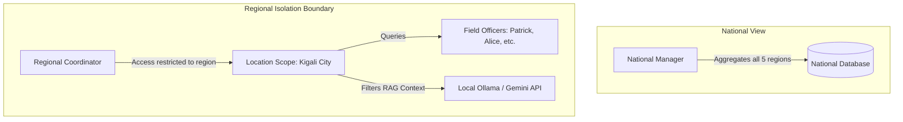
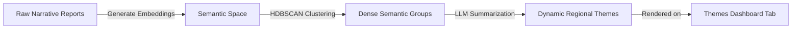

# SU Connect — Regional Coordinator AI Insights Redesign Specification

This document details the redesign specification for the **AI & Performance Analytics** page (`/ai-analysis` governed by `AIAnalysisDashboard.jsx`) tailored specifically for the **Regional Coordinator** (`regional_coordinator`) role. 

The goal of this redesign is to enforce strict location-based boundaries, remove irrelevant national noise, and introduce high-value, AI-driven features that show the direct utility of local Large Language Models (LLMs) and Machine Learning in regional coordination.

---

## 1. Role Context & Location-Based Scope
The Regional Coordinator supervises field operations within a single, specific province (e.g., **Kigali City**). Under Scripture Union's geographical isolation rules:
*   They must only see and analyze data generated by field officers assigned to their province.
*   Cross-provincial metrics represent data leakage and must be restricted.
*   The coordinator needs actionable operational intelligence (officer performance, bottlenecks, resource alerts) rather than global national trends.



---

## 2. Redesign Overview: What to Change, Remove, Update & Add

### ❌ 2.1 WHAT TO REMOVE (Eliminate Noise & Data Leaks)

To enforce geographical isolation and clean up the interface, the following elements will be removed for the Regional Coordinator:

1.  **Cross-Regional Comparison Charts:**
    *   *The Problem:* The "Regional Activity" bar chart displays all five provinces. Because of database-level regional isolation, all provinces other than the coordinator's own region display `0` reports, resulting in a mostly empty and uninformative visual.
    *   *Removal:* Remove the horizontal 5-province activity bar chart from the Overview sub-tab.
2.  **National Completion Rate Progress Bars:**
    *   *The Problem:* The Performance Analytics tab displays completion rates comparing Western, Southern, Eastern, Northern, and Kigali City. This is a National Manager concern.
    *   *Removal:* Remove cross-regional completion tables.
3.  **Self-Referential Insights & Alerts:**
    *   *The Problem:* The current alert system shows notifications like: *"Kigali City has filed only 1 report... Recommend connecting with the regional coordinator."* Since the logged-in user is the Kigali coordinator, this warning is a confusing self-referential loop.
    *   *Removal:* Remove notifications telling the coordinator to contact themselves.
4.  **Client-Side "Fake" AI Themes Count:**
    *   *The Problem:* The current Themes tab calculates counts (e.g., "Youth Engagement" or "Bible Study") using client-side substring checks (`r.title.toLowerCase().includes('youth')`). This is a static heuristic, not AI.
    *   *Removal:* Remove the substring-matching counters in `getThemeCount`.

---

### ✏️ 2.2 WHAT TO CHANGE (Refactor & Re-Scope)

Existing features will be refactored to focus on localized data and predictive, ML-driven charts:

| Current Feature | Redesigned Regional Coordinator Version | AI Implementation & Mechanics |
| :--- | :--- | :--- |
| **Regional Activity Bar Chart** | **Intra-Regional Field Officer Activity & Reach**<br>Displays report volume and participant reach compared among the Field Officers within the coordinator's province. | **Predictive Reach Lines:** Uses a regression model based on historical data to draw a dashed "Target Velocity" line, illustrating if the team is on track. |
| **Global Activity Pie Chart** | **Regional Category Distribution**<br>Pie chart scoped strictly to approved reports within the coordinator's region. | **Categorization Validation:** Feeds report text to Ollama (`qwen2.5vl:3b`) to classify it into one of 7 categories with confidence ratings. |
| **All-Region Table Data** | **Region-Scoped Analytics Table**<br>The table under the Categorization sub-tab is automatically filtered by `user.region`. | **Automated Content Tagging:** The AI reads report summaries and extracts semantic tags (e.g., `#discipleship`, `#material-shortage`) dynamically. |

---

### 🔄 2.3 WHAT TO UPDATE (Enhance AI Backend Scope & RAG)

These updates modify how the underlying AI services run to guarantee security and add intelligent assistance:

#### 1. RAG Chatbot Geographical Constraint Injection
*   **The Update:** When the Regional Coordinator queries the AI Chat Assistant, the frontend or backend must automatically inject the coordinator's region into the system prompt and vector search filter.
*   **AI Mechanism:** The system appends a constraint to the LLM prompt:
    ```json
    {
      "role": "system",
      "content": "You are the SU Connect AI Assistant. The current user is the Regional Coordinator for Kigali City. You are strictly forbidden from retrieving, referencing, or summarizing reports, activities, or names from Northern, Southern, Eastern, or Western Provinces. Answer queries using ONLY the provided Kigali City report embeddings."
    }
    ```
*   **Why it requires AI:** Traditional SQL searches cannot perform semantic Q&A. This RAG pipeline requires vector database filtering (e.g., PGVector metadata filtering on `region`) combined with LLM context window limits to enforce security boundaries.

#### 2. AI Chat Suggested Prompt Presets
*   **The Update:** Change the national suggested prompts in the Chat Assistant UI to region-specific operational questions.
*   **New Prompt Presets:**
    *   *"Summarize the major challenges reported by field officers in my region this month."*
    *   *"Which field officer reached the most participants, and what were their success factors?"*
    *   *"Draft a weekly summary email for the National Manager based on our approved reports."*
    *   *"Identify any resource shortages or materials requested in my region."*

---

### ➕ 2.4 WHAT TO ADD (New AI-Exclusive Features)

These are new, high-value administrative features powered exclusively by local AI inference. **None of these features can be built using traditional database queries.**

#### 1. AI-Generated Draft Feedback Drafts (Auto-Response Generator)
*   **The Feature:** When a coordinator decides to **"Return"** a report to a Field Officer for revision, they don't have to write comments from scratch. They can click "Generate Feedback".
*   **AI Mechanism:** The LLM compares the submitted draft report against SU Rwanda’s standard guidelines and the officer’s past approved reports. It highlights missing sections, statistical outliers (e.g., demographic mismatch where Male + Female != Total), and text quality, then pre-generates a constructive, polite feedback message in English or Kinyarwanda.
*   **Why it requires AI:** The system must read unstructured narrative text (e.g., *"We had a nice time but ran out of food and had to cut the session short..."*) and contrast it with reporting criteria to identify qualitative gaps.

#### 2. AI-Driven Local Semantic Clustering & Sentiment Drift (Themes Tab)
*   **The Feature:** Replacing static keywords with dynamic clustering. The coordinator sees emerging trends and officer sentiment (morale vs. burnout) in their region.
*   **AI Mechanism:** Uses a local sentence-transformer to generate embeddings of all report descriptions, then runs a density-based clustering algorithm (like HDBSCAN) to identify new local patterns. It uses the LLM to write a name for the cluster (e.g., *"Post-Exam Youth Stress"* or *"Transport Infrastructure Hurdles"*).
*   **Why it requires AI:** Natural language parsing is required to group semantically similar descriptions (e.g., *"impassable roads during rain"* and *"bridge washout delayed arrival"* must group under "Logistical Barriers" without relying on pre-defined keywords).



#### 3. AI-Synthesized Regional Monthly Summary (Executive Brief)
*   **The Feature:** A button that compiles all regional reports approved during the current month and generates a single, polished executive summary.
*   **AI Mechanism:** The system retrieves the text of all approved reports, groups them by department, and submits them to Ollama/Gemini with a template prompt. The output is a structured report featuring:
    1. Key Accomplishments
    2. Quantitative Reach Breakdown
    3. Critical Resource Bottlenecks
    4. Action Plan for Next Month
*   **Why it requires AI:** Aggregating quantitative fields is simple arithmetic, but synthesizing 20+ pages of narrative reports into a concise, professional 300-word executive summary is a core text-summarization task that requires a generative LLM.

#### 4. AI Localized Risk & Action Recommendation Alerts (Insights Tab)
*   **The Feature:** Instead of national alerts, the Insights tab shows specific action cards based on local anomalies.
*   **AI Examples:**
    *   *Resource Reallocation:* *"Resource bottleneck detected in Kicukiro: 3 reports from Field Officer Patrick mention a lack of Bible study guides. AI detects Gasabo district has a surplus of 40 guides from their completed program. Recommend reallocating resources."*
    *   *Reporting Anomaly Alert:* *"Field Officer Alice Mukamana's latest report has a high deviation in participant reach (240% increase compared to her 3-month rolling average) but no corresponding increase in budget or logistics. Recommend verifying the demographics."*
*   **Why it requires AI:** Requires combining anomaly detection (reach deviation) with semantic understanding of text (extracting "lack of guides" vs. "surplus of guides") to make cross-officer operational recommendations.

---

## 3. UI/UX & Glassmorphic Visual Layout Recommendations

To ensure the new dashboard matches the premium Scripture Union Connect design guidelines, we will apply the following visual tokens:

*   **Glassmorphism Container Cards:**
    *   `background: rgba(18, 38, 18, 0.4);` (for dark mode matching the deep green aesthetic in the screenshots).
    *   `backdrop-filter: blur(12px); border: 1px solid rgba(76, 175, 80, 0.15);`
*   **Localized Context Header:**
    *   Include a region tag next to the title:
      ```jsx
      <h1 className="page-title">
        <Brain /> AI Insights & Analytics 
        <span className="badge badge-success" style={{ marginLeft: 12 }}>Kigali City Scope</span>
      </h1>
      ```
*   **Clean Status Badging:**
    *   AI confidence scores should use dynamic color gradients: high confidence (green gradient), medium confidence (amber gradient), low/needs-review (red-orange gradient).
*   **Interactive Visualizations:**
    *   Intra-regional charts should match the SU branding, using green, teal, and gold hex colors (`#2e7d32`, `#4caf50`, `#81c784`, `#ffb300`).
