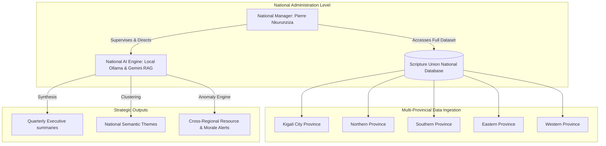
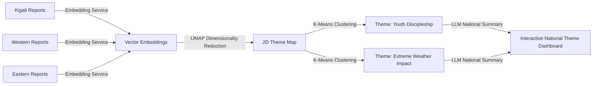

# SU Connect — National Manager AI Report Insights Redesign Specification

This document details the redesign specification for the **AI Report Insights** subtab (and associated AI-driven analytics views within `/ai-analysis` governed by [AIAnalysisDashboard.jsx](file:///d:/FINAL-Project/Front-End/src/pages/ai-analysis/AIAnalysisDashboard.jsx)) tailored specifically for the **National Manager** (`national_manager` role, e.g., Pierre Nkurunziza).

The goal of this redesign is to elevate the dashboard from a localized, single-region view to a high-value, strategic **National Intelligence Dashboard**. It eliminates micromanagement clutter and highlights cross-regional performance comparisons, predictive trend modeling, semantic theme clustering, and macro-level anomaly detection.

---

## 1. Role Context & National Scope

Unlike the Regional Coordinator (who is restricted to a single geographical boundary like Kigali City), the National Manager has full read-write privileges and visibility across all five provinces of Rwanda (Kigali City, Northern, Southern, Eastern, and Western) and all departments (Bible Study, Outreach, Youth Program, etc.).



---

## 2. Division of Labor: AI vs. Deterministic Logic (No-AI)

To maintain absolute data integrity and system trust, we define a clear separation of concerns. **AI must only be used where semantic interpretation is needed, and forbidden where exact calculations or database integrity audits are required.**

| Dashboard Function | Implementation Mode | Logic & Rationale |
| :--- | :--- | :--- |
| **Total Reports Aggregation** | **Deterministic (No-AI)** | Simple SQL counts (`COUNT(id)`). Using an LLM or ML model to count reports is prone to hallucination and is highly inefficient. |
| **Regional Completion Rates** | **Deterministic (No-AI)** | Computed mathematically by comparing submitted reports against scheduled deadlines (`(submitted / scheduled) * 100`). Needs to be 100% accurate for payroll and compliance audits. |
| **Participant Reach Totals** | **Deterministic (No-AI)** | Pure integer addition (`SUM(total_participants)`). Precise financial and donor reporting requires exact mathematical calculations. |
| **Cross-Regional Semantic Themes** | **AI-Essential** | Natural language processing (NLP) to cluster reports dynamically (e.g. grouping "impassable roads" and "heavy rain delays" under *Logistical Obstacles*). Heuristics or substring searches cannot capture semantic synonyms. |
| **National Trend Forecasting** | **AI-Essential** | Time-series regression models (like ARIMA or Prophet) to forecast participant reach volumes for the next quarter based on historical seasonality. |
| **Cross-Regional Anomaly Detection** | **AI-Essential** | Unsupervised clustering (e.g. Isolation Forests) and semantic drift analysis to identify duplicate text reporting, reporting fatigue, or extreme narrative deviations. |
| **Custom Report Builder Synthesis** | **AI-Essential** | Large Language Model text summarization to compile hundreds of narrative paragraphs into a structured, executive-ready 400-word digest. |

---

## 3. Redesign Overview: What to Remove, Change, Update & Add

### ❌ 3.1 WHAT TO REMOVE (Eliminating Micromanagement Noise & Static Heuristics)

To keep the National Manager's dashboard clean and focused on strategic decisions, the following features will be removed or suppressed:

1.  **Field-Level Officer Feedback Tools on Overview:**
    *   *The Problem:* The National Manager does not need to issue direct revision requests (e.g., returning reports for typos) to individual Field Officers. That is the job of the Regional Coordinator.
    *   *Removal:* Remove the "Generate Feedback Drafts" and manual report override controls from the manager's default view.
2.  **Static Keyword Substring Search (Themes Tab):**
    *   *The Problem:* The current dashboard counts categories by looking for literal words like `'youth'` or `'bible'` in the title. If a report is about *"discipleship and scripture engagement,"* it fails to register.
    *   *Removal:* Remove client-side string-matching theme counts.
3.  **Local Coordinator Alerts & Reminders:**
    *   *The Problem:* Alerts asking the user to *"connect with the Regional Coordinator for Northern Province"* are useful for the manager, but the dashboard currently generates static fallback strings instead of querying real DB states.
    *   *Removal:* Remove static fallback templates for alerts and notifications.

---

### ✏️ 3.2 WHAT TO CHANGE (Refactor for Macro-Level Comparisons)

Existing features will be upgraded to support comparative views across all 5 provinces and multiple departments:

1.  **Regional Activity Map / Bar Chart:**
    *   *Change:* Refactor the current flat horizontal bar chart to a clustered bar chart comparing **Target Completion Rate** vs **Actual Completion Rate** across all 5 provinces (Kigali City, Northern, Southern, Eastern, Western) side-by-side.
    *   *AI Enhancement:* Inject a predictive line showing projected performance for the next month based on historical trends.
2.  **Activity Distribution Pie Chart:**
    *   *Change:* Replace the basic single-level pie chart with a double-level sunburst or drill-down chart. The top level represents *National Category Distribution* (Outreach vs. Bible Study vs. Training). Clicking a category dynamically pivots the pie chart to show *Regional Distribution* for that specific category.
3.  **All-Region AI-Classified Reports Table:**
    *   *Change:* Currently, this table lists every single report sequentially. For a National Manager, this is hundreds of rows. Update this to group reports by **Region** and **Department** using accordion-style collapsing rows.
    *   *AI Metric Addition:* Add an **AI Anomaly Indicator Badge** (e.g., ⚠️ *High Semantic Copying* or ⚠️ *Outlier Metrics*) so the manager can quickly identify reports that require coordinator attention.

---

### 🔄 3.3 WHAT TO UPDATE (Elevating AI Backend Scope & RAG Chat)

We will update the system's underlying AI prompts, filters, and RAG configuration to empower the National Manager with country-wide access:

#### 1. RAG Chat Assistant Context Elevation
*   **The Update:** Remove regional vector search filters when a National Manager is logged in. The assistant must query the entire vector database containing data from all regions.
*   **AI Prompt Injection:** The system automatically configures the LLM prompt context:
    ```json
    {
      "role": "system",
      "content": "You are the SU Connect Executive AI Advisor. The current user is the National Manager, Pierre Nkurunziza. You have unrestricted access to all 5 provinces of Rwanda. Your task is to perform comparative analyses, identify national operational risks, synthesize country-wide trends, and draft formal reports. Ensure you highlight regional discrepancies when asked."
    }
    ```

#### 2. National suggested prompts in the Chat Assistant UI:
*   *"Compare the youth outreach effectiveness in Eastern Province vs. Western Province this quarter."*
    *   *"Summarize the national Bible Study resource issues and list which regions are hit hardest."*
    *   *"Generate a draft for Scripture Union Rwanda's National Monthly Executive Brief."*
    *   *"Which region shows the highest risk of reporting fatigue or missed targets?"*

---

### ➕ 3.4 WHAT TO ADD (High-Value National AI Features)

These features utilize machine learning and LLMs to solve strategic administration challenges. They cannot be built with standard database aggregates.

#### 1. Cross-Regional Semantic Theme Alignment & Sentiment Mapping
*   **The Feature:** A visualization mapping semantic themes across regions. The manager can see if a theme is a localized outlier or a national trend.
*   **AI Mechanism:** The system generates embeddings of all approved reports across all 5 provinces, projects them into a 2D space using UMAP, and uses K-Means or HDBSCAN to group them. It highlights themes that are common in all provinces vs. themes isolated to specific regions (e.g., *material shortages* in Southern Province, *flooding challenges* in Western Province).
*   **Why it requires AI:** Traditional databases cannot group unstructured, multi-dialect paragraphs (English, French, Kinyarwanda) by semantic similarity without manual tagging.



#### 2. AI Anomaly Engine & Reporting Integrity Monitor
*   **The Feature:** An automated integrity detector that flags suspect submissions.
*   **AI Examples:**
    *   *Semantic Duplication Check:* Flagging if a field officer copied and pasted their narrative description from a previous month or from another officer (Cosine similarity of embeddings > 0.92).
    *   *Logical Outlier Flagging:* Flagging reports where narrative text contradicts numbers (e.g., *"We had a small turnout due to heavy rain..."* paired with a participant count entry of `350`).
*   **Why it requires AI:** Detecting copy-paste text variance (changing minor words to trick simple keyword checks) and cross-referencing qualitative narratives against numerical entries requires deep semantic comprehension.

#### 3. Strategic National Report Synthesis & Multi-Format Exporter
*   **The Feature:** A generator that compiles custom executive briefs across selected provinces and departments into beautifully formatted PDF and Excel documents.
*   **AI Mechanism:** The manager selects the parameters (e.g., Q2 2025, Kigali City + Western Province, Outreach). The system queries all matching records and uses the LLM to write:
    1.  **Executive Synthesis:** A cohesive summary of outcomes and impacts.
    2.  **Resource Allocation Analysis:** Highlighting where budgets matched participant reach.
    3.  **Recommendations:** Suggested actions for regional coordinators.
*   **Why it requires AI:** High-quality executive summaries require synthesizing multiple pages of disjointed stories, testimonies, and administrative narratives into structured, coherent paragraphs.

---

## 4. Premium UI/UX Specifications (National Manager View)

To match the high-end, responsive dark green design system of Scripture Union Connect, the National Manager view will employ the following styling:

*   **National Scope Header Indicator:**
    *   A prominent, animated glowing badge next to the title:
      ```jsx
      <div className="flex items-center gap-3">
        <Brain className="text-emerald-400 animate-pulse" />
        <h1 className="text-2xl font-extrabold text-white">AI National Analytics & Insights</h1>
        <span className="px-3 py-1 text-xs font-semibold tracking-wider text-emerald-300 bg-emerald-950/60 border border-emerald-500/30 rounded-full">
          National Manager Scope
        </span>
      </div>
      ```
*   **Glassmorphic Interactive Heatmap:**
    *   Replace standard maps with a custom interactive SVG map of Rwanda's 5 provinces. 
    *   Provinces are color-coded based on AI-determined sentiment or reporting completion rates (using smooth gradients from deep emerald green to gold).
    *   Hovering over a province displays a glassmorphic tooltip with AI-generated quick summaries (e.g. *"Kigali City: 14 Reports, 92% Completion. Key Theme: Youth Mentorship. Status: Stable"*).
*   **AI Inference Status Indicators:**
    *   Whenever an AI model runs in the background (e.g., trend forecasting or custom report building), a skeleton loader with a green gradient shimmer effect is shown, accompanied by a status message detailing the AI's step (e.g., *"Clustering 148 report narratives..."*, *"Generating RAG embeddings..."*).

---

## 5. Verification Plan

The implementation of these features will be validated through both automated test cases and manual inspection:

### 5.1 Automated Tests
- **RAG Security Tests:** Verify that the system prompt injection works correctly and does not leak unauthorized regional data when query scopes are modified.
- **Data Aggregation Tests:** Verify that all numeric fields (totals, averages) are mathematically correct and do not use LLM approximation.
- **Export Integrity Tests:** Ensure generated PDFs and Excel reports have standard formatting and correct data layouts without placeholder content.

### 5.2 Manual Verification
- **Role Switching:** Log in as the National Manager (Pierre Nkurunziza) and confirm that all 5 regions are visible in the filter controls and charts.
- **Theme Exploration:** Interact with the Themes tab to verify that clusters are dynamically generated from the backend instead of static substring matches.
- **Anomaly Inspection:** Review the AI Anomaly Indicators in the reports table to confirm that flag criteria are applied correctly.
