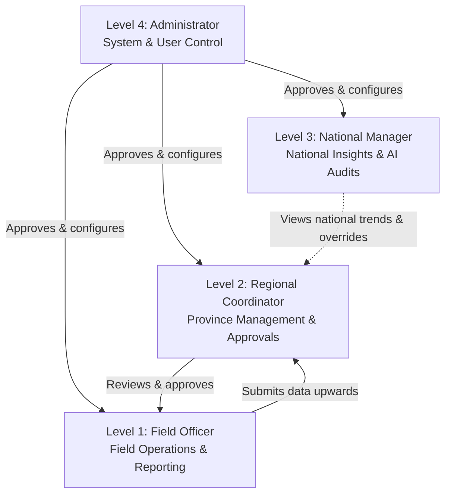
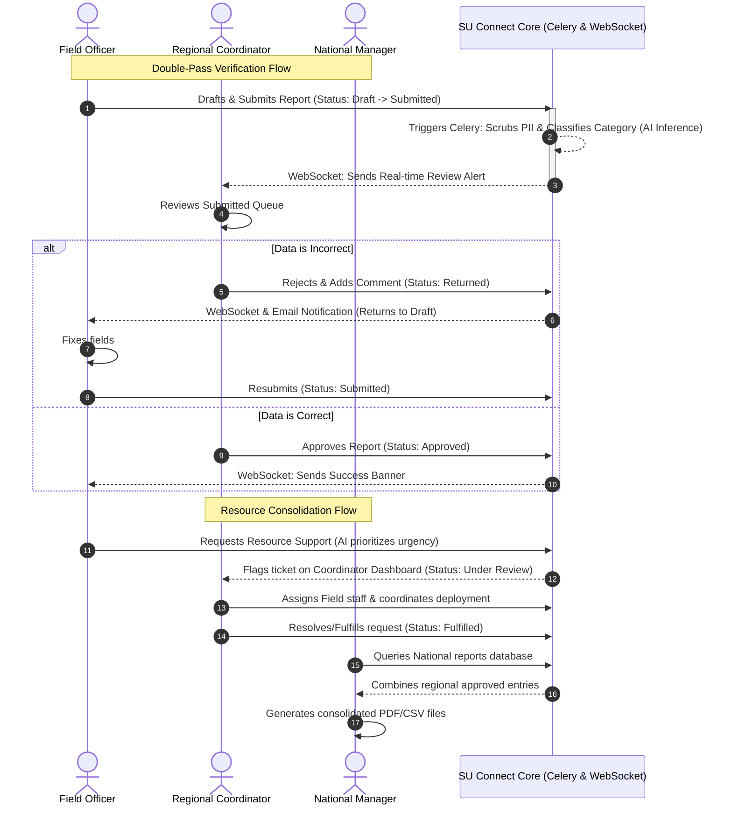
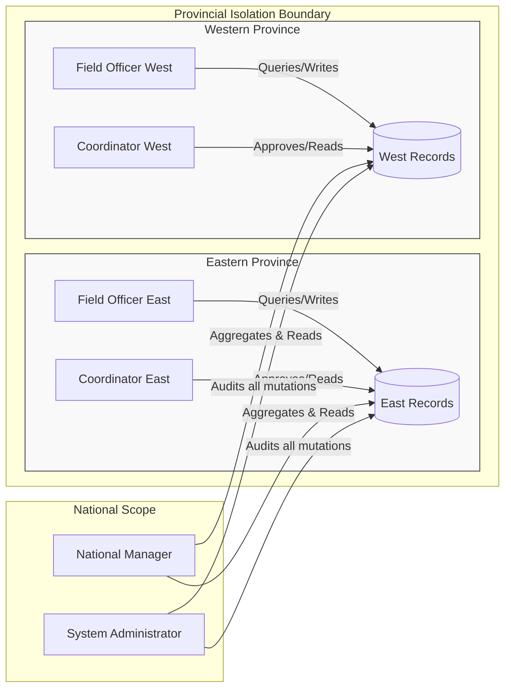

# SU Connect — Role-Based Administration Levels, Features, and Location-Based Workflows Guide

This document outlines the administrative hierarchies, features, dashboards, and design recommendations for **SU Connect** (Scripture Union Rwanda Connect). It details how users from different roles and locations collaborate securely and efficiently.

---

## 1. Administration Levels & Role Hierarchy

SU Connect implements a strict **Role-Based Access Control (RBAC)** hierarchy with four distinct administrative levels. Each level corresponds to specific operational boundaries and responsibilities.

| Admin Level | Role Identifier | Scope of Access | Core Focus | Authentication Requirement |
| :---: | :--- | :--- | :--- | :--- |
| **Level 4** | `administrator` | **System-Wide (Admin)** | Infrastructure, Security Auditing, User Approvals, Configurations | **MFA (TOTP) Mandatory** |
| **Level 3** | `national_manager` | **Nationwide (Operational)** | Global Analytics, AI Summaries & Overrides, Consolidated Reporting | Standard Login |
| **Level 2** | `regional_coordinator`| **Regional (Management)** | Local Approval Workflows, Regional Support Assignment, Team Performance | Standard Login |
| **Level 1** | `field_officer` | **Individual/Regional (Field)**| Outreach Data Collection, Resource Support Requests, Prayer Wall | Standard Login |



---

## 2. Features & Activities by Role

Each role logs into a tailored workspace containing specific data pipelines and features. Below is the comprehensive breakdown of dashboards and page interactions for each actor.

### 2.1 Field Officer (`field_officer`)
*The primary operational data source. Field officers work directly in their assigned provinces, logging outreach events and requesting support.*

*   **Dashboard Features:**
    *   **KPI Metric Cards:** Displays personal statistics (My Reports, Pending Review, Approved Reports, My Reach/Total Participants).
    *   **Activity Date Filters:** Allows filtering dashboard statistics using "From" and "To" date range selectors.
    *   **Upcoming Deadlines Widget:** Lists reporting and action deadlines, color-coded by priority (Urgent/High/Primary) with automatic countdown of days left.
    *   **Recent Activity Feed:** Paginated timeline (3 items per page) showing the history of report submissions, approved files, or support requests.
    *   **Outreach Submission Banner:** Highlights the last active submission date and reminds the officer of weekly deadline rules (e.g., Friday 5:00 PM).
*   **Actionable Activities & Pages:**
    *   **Report Workspace (`/reports` & `/reports/new`):** Drafts, edits, and submits activity reports. Includes demographic inputs (with automatic sum checks validating that Male + Female equals total participants).
    *   **Support Requests (`/support` & `/support/new`):** Creates resource requests (finances, training materials, transport). Utilizes **local AI priority checks** (via Ollama Qwen) to evaluate descriptions and suggest a priority level (`low`, `medium`, `high`, `urgent`) with reasoning before submission.
    *   **Prayer Wall (`/prayer`):** Posts prayer points, views regional/national prayer items, and clicks the **"Commit to Pray"** button to support colleagues in real-time.
    *   **Document Repository (`/documents`):** Uploads files (JPEG, PDF, Docx) to support reports or share within the regional boundary.

---

### 2.2 Regional Coordinator (`regional_coordinator`)
*The supervisor of regional activities. Coordinators review data accuracy, approve/return reports, and assign resources within their provincial boundaries.*

*   **Dashboard Features:**
    *   **Regional KPI Metric Cards:** Tracks Pending Reviews, Approved This Month, Active Team Size, and Regional Reach.
    *   **Pending Approvals Queue:** Quick-action cards listing reports submitted by Field Officers in their region. Includes report details, reach counts, and direct action buttons (**Approve** / **Return**).
    *   **Team Performance Tracker:** Bar progress meters showing submission rates, reports submitted, and pending approvals for each Field Officer in their team.
    *   **Recent Team Activity Timeline:** Chronological feed tracking report submissions, comments, or support requests logged by their staff.
    *   **Regional Deadlines Widget:** Displays operational deadlines relevant to their province.
*   **Actionable Activities & Pages:**
    *   **Double-Pass Review:** Reviews details of reports. If a report is inaccurate, they input correction comments and trigger **"Return"** (status shifts back to `draft`). If correct, they click **"Approve"**.
    *   **Support Ticket Coordinator (`/support`):** Views, comments on, and assigns regional support requests to specific field staff.
    *   **AI & Analytics Hub (`/ai-analysis`):** Conducts semantic searches on regional reports and queries the RAG Chatbot using natural language (e.g., *"Summarize our training outcomes in the Southern Province"*).
    *   **Prayer Wall Engagement:** Posts leadership prayer requests and pledges intercessory commitments.

---

### 2.3 National Manager (`national_manager`)
*The strategic viewer of nationwide operations. The manager focuses on trends, AI insights, and cross-provincial reporting.*

*   **Dashboard Features:**
    *   **Global Reach Metric Cards:** Total Nationwide Reach, Pending Nationwide Reviews, Average Approval Rate, and Total Prayer Requests active.
    *   **Outreach Trend Chart:** Recharts Area Chart displaying a monthly overlay of submitted vs. approved reports across all of Rwanda.
    *   **Regional Performance Breakdown:** Interactive progress bar chart ranking provinces by participant numbers, showing growth rates and submission totals.
    *   **AI Operational Insights Panel:** Summary of positive patterns or areas needing attention, automatically extracted from reports by the local AI engine.
    *   **Urgent Attention Alerts List:** Lists critical system events (e.g., urgent regional support requests or overdue reporting milestones).
*   **Actionable Activities & Pages:**
    *   **Consolidated Report Generator:** Selects multiple regional reports, aggregates their quantitative metrics, and exports clean PDF summaries (optimized for printing via `window.print()`) or raw CSV logs.
    *   **AI Metadata Overrides (`/reports/:id/ai-override`):** Reviews and overrides AI-categorized labels on reports if the LLM misinterprets the activity details (setting `overridden = true` for audit safety).
    *   **Document Vault Access:** Downloads documentation from any region to verify operations.
    *   **Global Announcements (`/notifications`):** Posts system-wide announcements that display on the dashboards of all coordinators and officers.

---

### 2.4 Administrator (`administrator`)
*The system guardian. The admin holds exclusive access to user setup, security audit logs, and infrastructure health gauges.*

*   **Dashboard Features:**
    *   **Infrastructure Health Gauges:** Real-time health metrics monitoring the status of the PostgreSQL Database connection, Redis broker ping, Celery task workers, and server memory.
    *   **Pending Registrations Queue:** A review table for newly registered staff accounts.
    *   **MFA Compliance Status Tracker:** Interactive bars representing the percentage of users with Multi-Factor Authentication enabled, categorized by role.
    *   **System Usage Trends Chart:** Recharts Bar chart showing a 7-day volume breakdown of logins, reports, and API calls.
*   **Actionable Activities & Pages:**
    *   **User Management (`/users`):** Activates accounts, assigns roles (`field_officer`, `regional_coordinator`, etc.), and locks/unlocks profiles.
    *   **Security & Audit Log (`/security`):** Reviews immutable audit logs capturing every database mutation, showing user snapshot details, API routes, origin IP addresses, action descriptions, and severity levels.
    *   **System Settings Configuration (`/settings`):** Configures security limits (e.g., failed login caps, password complexity) and toggles system-wide maintenance modes.

---

## 3. Design & Feature Recommendations

Based on the current implementation, here are targeted recommendations to elevate the visual aesthetic, streamline usability, and improve system features.

### 3.1 Suggested Visual Architecture (How the pages should look)
To align with a high-end, premium dashboard experience, we suggest implementing the following design tokens:

*   **Visual Structure:** Apply a unified, clean layout using a **left-anchored collapsible sidebar** (already structured in [Sidebar.jsx](file:///d:/FINAL-Project/Front-End/src/components/layout/Sidebar.jsx)) and a flat header bar displaying context actions (User Profile, Notifications, Theme toggle).
*   **Aesthetic Style (Glassmorphism & Gradients):**
    *   Instead of solid, flat background colors, use card elements with subtle backdrops: `backdrop-filter: blur(12px); background: rgba(var(--card-rgb), 0.7); border: 1px solid rgba(var(--border-rgb), 0.08)`.
    *   Apply smooth, low-contrast gradients for status banners and indicators (e.g., blue-purple for AI insights, amber-orange for warning alerts).
*   **Theme Integration:** Ensure the application utilizes native CSS variables to shift between dark and light modes smoothly.
*   **Micro-Animations:** Use subtle scale hover effects (`transform: scale(1.02); transition: all 0.2s ease`) on quick action buttons and metric cards to make the interface feel responsive and alive.

---

### 3.2 Feature Matrix: What to Keep, Edit, Remove, or Add

```carousel
#### 🌟 WHAT IS ESSENTIAL (Must Have)
- **Role-Based Routing Dashboard:** Automatically directing users to their correct workspace.
- **Demographics Validator:** Enforcing math integrity (Male + Female = Total Attendees) at the form level.
- **Strict Location Isolation:** Query limits preventing cross-province data leakage.
- **Immutable Security Audits:** Tracking administrative changes for organizational reporting.
- **MFA (TOTP) Setup:** Protecting administrative credentials.
<!-- slide -->
#### ✏️ WHAT TO EDIT (Refactor & Improve)
- **Date Inputs:** Modernize standard HTML date selectors in `FieldOfficerDashboard` to support calendar overlays.
- **Alert Modals:** Replace standard browser `prompt()` prompts (currently used in user rejection and report returns) with custom, glassmorphic UI modals.
- **Excel/CSV Consolidation:** Optimize memory consumption by using stream-based file compilation when National Managers generate large reports.
- **Timeline Pagination:** Keep timeline elements to 3 items per page, but wrap them in smooth fade animations during transitions.
<!-- slide -->
#### ❌ WHAT IS UNNECESSARY (Can be Removed/Simplified)
- **RAG for Vision Images:** Skip vector document search when analyzing vision images; instead, process the image array directly to speed up response times.
- **Local Media Backup Sync:** Avoid syncing local media uploads to cloud services for draft reports; only upload file attachments upon formal report submission.
- **MFA for Field Officers:** Multi-Factor Authentication can be disabled or made optional for Level 1 Field Officers in rural zones to avoid login friction, keeping it strictly mandatory for Level 4 Administrators.
<!-- slide -->
#### ➕ WHAT CAN BE ADDED (New Features)
- **Offline Report Staging:** Allow Field Officers to draft reports offline in local browser cache (IndexedDB) and auto-sync when network connectivity is restored.
- **AI Audio Summarizer:** Add a microphone button allowing field staff to record oral summaries in Kinyarwanda, converting audio to text templates.
- **Automated Deadline Notifications:** A Celery-managed automated email reminder dispatching report reminders to coordinators if their team has unreviewed files by Thursday afternoon.
- **Export to PDF Formatting:** Add custom CSS page-break tags to reports, guaranteeing clean print layouts on standard A4 paper.
```

---

## 4. Collaborative Workflows: How They Work Together

The actors in SU Connect do not work in isolation; they are connected through real-time communication channels and state transitions:



### 4.1 Key Feedback Loops
1.  **Reporting Verification Loop:** Prevents bad data from reaching the national database. Reports are restricted until approved. If returned, the Field Officer is notified immediately to update their draft.
2.  **Support Tickets Comments Loop:** Requesters (Officers) and coordinators engage in comments directly on the ticket. This keeps discussions contextualized and avoids long email chains.
3.  **National Override Loop:** If the AI incorrectly categorizes an outreach event (e.g., labeling a *Bible Study* as *Administrative Meeting*), the National Manager can override it, which trains the system logs to reflect manual corrections.

---

## 5. Location-Based Operations (Geographical Isolation)

Scripture Union Rwanda operates across five regions: **Kigali City, Northern Province, Eastern Province, Southern Province, and Western Province**. 

Since staff are working from different locations, the system secures and isolates operations to prevent unauthorized access while aggregating statistics seamlessly at the national level.



### 5.1 Technical Implementation of Regional Isolation
To allow staff in different locations to log in and see only their local context, the system enforces access control at both the Database and API layers:

1.  **User Context Isolation:**
    *   Every user record in the `accounts_user` table holds a `region` field (e.g., `Eastern Province`).
    *   During authentication, the user's region is decoded from the JWT token and stored in the application session context.
2.  **Database Query Filters (`RegionalQuerySet` / `RegionalManager`):**
    *   The Django backend uses a custom manager that overrides standard SQL queries.
    *   For `field_officer` and `regional_coordinator` roles, the query is automatically appended with a `WHERE region = request.user.region` filter:
        ```python
        # Conceptual representation of backend query filter
        class RegionalQuerySet(models.QuerySet):
            def filter_by_user(self, user):
                if user.role in ['field_officer', 'regional_coordinator']:
                    return self.filter(region=user.region)
                return self # National Managers & Admins can access all records
        ```
    *   This database isolation ensures that a coordinator in the **Southern Province** cannot view or edit reports belonging to the **Kigali City** province.
3.  **Frontend Adaptability:**
    *   When a Field Officer creates a new report, the **Region** dropdown is auto-selected and locked to the user's profile region. This prevents officers from accidentally submitting data to the wrong province.
    *   Dashboard analytics, graphs, and schedules dynamically filter metrics based on the geographical region returned by the user context API.
4.  **National Consolidation & Aggregation:**
    *   Since all records are stored in a centralized PostgreSQL database but logically separated by the `region` column, National Managers are bypass-authorized.
    *   They run query requests without provincial filters, permitting the backend to generate cross-regional charts and compile consolidated PDF reports covering the entire country.
