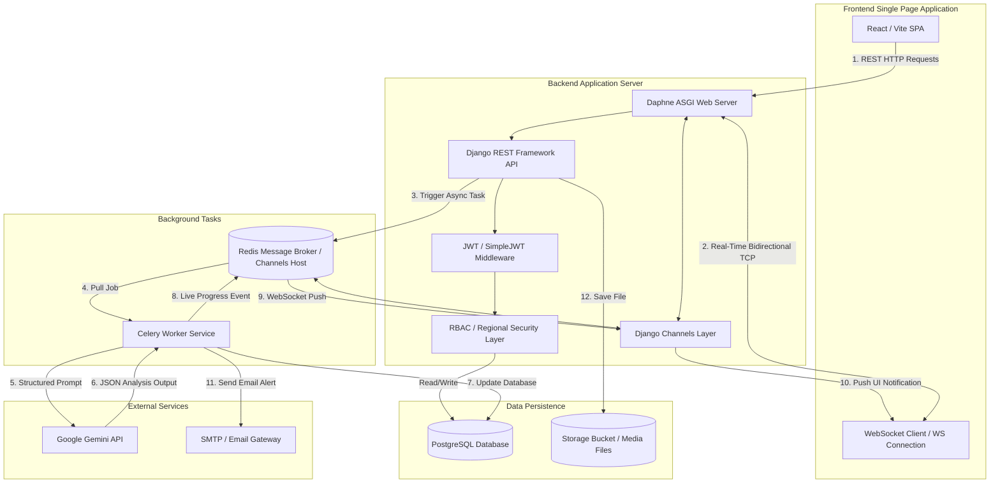
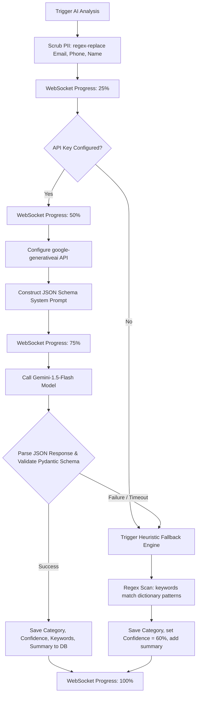

# SU Connect — System Architecture & Workflow Description

This document provides a comprehensive, highly detailed specification of the **SU Connect** (Scripture Union Rwanda AI-Powered Reporting & Support System) platform. It details how the frontend React Single Page Application (SPA), the Django REST backend, the Celery asynchronous worker queue, the WebSockets real-time layer, and the Google Gemini AI subsystem integrate to automate reporting, audit activities, handle support requests, manage documents, and enforce security controls.

---

## 1. System & Deployment Architecture

SU Connect is designed with a split, modular architecture containing three main logical tiers: Client SPA, Backend REST API + Real-Time Engine, and Asynchronous Worker Queue.



### 1.1 Technical Stack Core Components
1. **Frontend SPA**: React (v18+) with Vite, Tailwind CSS or custom Vanilla CSS, React Router for client routing, and WebSocket connections for real-time progress.
2. **Backend Engine**: Python (v3.10+) with Django Framework (v6.0.5+) and Django REST Framework (v3.14.0) serving APIs.
3. **Real-time Subsystem**: ASGI server (Daphne), Django Channels (v4.0.0), and `channels-redis` (v4.2.0) managing live WebSocket group broadcasts.
4. **Background Task Runner**: Celery (v5.3.6) with Redis (v5.0.1) as the message broker, storing task status via `django-celery-results` (v2.5.1).
5. **Database**: PostgreSQL with indexing optimized for regional querying and foreign keys configured with strict referential constraints.
6. **AI Integration**: Google Gemini API (`gemini-1.5-flash`) via the `google-generativeai` client, using `pydantic` (v2.6.4+) for schema validation.
7. **File Storage**: Django Storages (v1.14.2) with Amazon Boto3 AWS S3 configuration or local filesystem media storage fallbacks.

---

## 2. Core Entities & Relational Database Schema

The database model is mapped in PostgreSQL. Below is the complete relational structure, including attributes, data types, indexes, and constraints.

### 2.1 Entity Details

#### 2.1.1 User (`users` table)
Stores profile configurations, authentication details, Multi-Factor Authentication (MFA) secrets, and communication settings.
*   `id`: `UUID` (Primary Key, default: `uuid_generate_v4()`)
*   `name`: `VARCHAR(255)` (Required)
*   `email`: `VARCHAR(255)` (Required, Unique, Indexed)
*   `password_hash`: `VARCHAR(255)` (Required)
*   `role`: `ENUM('admin', 'manager', 'staff', 'coordinator')` (Required)
*   `region`: `VARCHAR(100)` (Required, e.g., 'Kigali City', 'Northern Province')
*   `department`: `VARCHAR(100)` (Required, e.g., 'Youth Ministry', 'Field Operations')
*   `position`: `VARCHAR(100)` (Required, e.g., 'Field Coordinator')
*   `phone`: `VARCHAR(30)` (Optional)
*   `avatar`: `VARCHAR(10)` (Initials generated automatically from name)
*   `status`: `ENUM('active', 'inactive')` (Default: `active`)
*   `mfa_enabled`: `BOOLEAN` (Default: `FALSE`)
*   `mfa_secret`: `VARCHAR(255)` (Used for TOTP 2FA secret generation)
*   `last_login`: `TIMESTAMP WITH TIME ZONE` (Nullable)
*   `join_date`: `DATE` (Required, default: `CURRENT_DATE`)
*   `notif_prefs`: `JSONB` (Default: `{"email": true, "sms": false, "inApp": true, "deadlineReminders": true, "reportUpdates": true, "supportUpdates": true, "prayerResponses": false}`)
*   `created_at` / `updated_at`: `TIMESTAMP WITH TIME ZONE` (Default: `NOW()`)

#### 2.1.2 Report (`reports` table)
Stores descriptive activity summaries, participant attendance counts, demographic breakdowns, and AI-generated metadata.
*   `id`: `BIGSERIAL` (Primary Key)
*   `title`: `VARCHAR(255)` (Required)
*   `type`: `ENUM('Outreach', 'Bible Study', 'Training', 'Meeting', 'Community Event', 'Prayer Meeting', 'Youth Program')` (Required)
*   `region`: `VARCHAR(100)` (Required, Indexed)
*   `department`: `VARCHAR(100)` (Required)
*   `activity_date`: `DATE` (Required, Indexed)
*   `duration`: `VARCHAR(100)` (Optional, e.g., '4 hours')
*   `location`: `VARCHAR(255)` (Optional)
*   `status`: `ENUM('draft', 'submitted', 'approved', 'returned')` (Default: `draft`, Indexed)
*   `submitted_by_id`: `UUID` (Foreign Key referencing `users(id)`, `ON DELETE RESTRICT`)
*   `participants`: `INTEGER` (Default: `0`)
*   `demographics`: `JSONB` (Default: `{"male": 0, "female": 0, "youth": 0, "adults": 0}`)
*   `description`: `TEXT` (Required)
*   `outcomes`: `TEXT` (Optional)
*   `challenges`: `TEXT` (Optional)
*   `prayer_requests`: `TEXT` (Optional)
*   `ai_category`: `VARCHAR(100)` (Nullable, AI classification output)
*   `confidence`: `INTEGER` (Nullable, 0-100 score)
*   `keywords`: `TEXT[]` (Extracted tag array)
*   `ai_summary`: `TEXT` (Nullable, brief summary of findings)
*   `overridden`: `BOOLEAN` (Default: `FALSE`, set to `TRUE` if an admin/manager changes `ai_category`)
*   `created_at` / `updated_at`: `TIMESTAMP WITH TIME ZONE` (Default: `NOW()`)

#### 2.1.3 SupportRequest (`support_requests` table)
Manages material, financial, training, personnel, and intercessory resources requests.
*   `id`: `BIGSERIAL` (Primary Key)
*   `type`: `ENUM('Material', 'Financial', 'Personnel', 'Training', 'Prayer', 'Other')` (Required)
*   `title`: `VARCHAR(255)` (Required)
*   `description`: `TEXT` (Required)
*   `justification`: `TEXT` (Optional context explaining the necessity)
*   `requester_id`: `UUID` (Foreign Key referencing `users(id)`, `ON DELETE RESTRICT`)
*   `region`: `VARCHAR(100)` (Required, Indexed)
*   `priority`: `ENUM('low', 'medium', 'high', 'urgent')` (Required)
*   `status`: `ENUM('submitted', 'under review', 'approved', 'fulfilled', 'closed')` (Default: `submitted`, Indexed)
*   `deadline`: `DATE` (Optional completion date target)
*   `submitted_date`: `TIMESTAMP WITH TIME ZONE` (Default: `NOW()`)
*   `assigned_to_id`: `UUID` (Foreign Key referencing `users(id)`, `ON DELETE SET NULL`)
*   `created_at` / `updated_at`: `TIMESTAMP WITH TIME ZONE` (Default: `NOW()`)

#### 2.1.4 SupportComment (`support_comments` table)
Maintains conversation logs and status change justifications for Support Requests.
*   `id`: `BIGSERIAL` (Primary Key)
*   `support_request_id`: `BIGINT` (Foreign Key referencing `support_requests(id)`, `ON DELETE CASCADE`)
*   `author_id`: `UUID` (Foreign Key referencing `users(id)`, `ON DELETE RESTRICT`)
*   `comment_text`: `TEXT` (Required comment description)
*   `created_at`: `TIMESTAMP WITH TIME ZONE` (Default: `NOW()`)

#### 2.1.5 PrayerRequest (`prayer_requests` table)
Tracks prayer points shared within the Scripture Union community.
*   `id`: `BIGSERIAL` (Primary Key)
*   `title`: `VARCHAR(255)` (Required)
*   `description`: `TEXT` (Required)
*   `submitted_by_id`: `UUID` (Foreign Key referencing `users(id)`, `ON DELETE SET NULL`, Nullable for anonymous submissions)
*   `submitted_by_name`: `VARCHAR(255)` (Stores user name snapshot or 'Anonymous')
*   `region`: `VARCHAR(100)` (Required, Indexed)
*   `type`: `ENUM('Revival', 'Protection', 'Resources', 'Health', 'Unity', 'Youth', 'Staff', 'General')` (Required)
*   `priority`: `ENUM('low', 'medium', 'high', 'urgent')` (Required)
*   `status`: `ENUM('pending', 'prayed', 'answered')` (Default: `pending`, Indexed)
*   `anonymous`: `BOOLEAN` (Default: `FALSE`)
*   `request_date`: `DATE` (Default: `CURRENT_DATE`)
*   `responses_count`: `INTEGER` (Default: `0`, increments when users pledge to pray)
*   `themes`: `TEXT[]` (Nullable theme keywords list)
*   `created_at` / `updated_at`: `TIMESTAMP WITH TIME ZONE` (Default: `NOW()`)

#### 2.1.6 PrayerResponse (`prayer_responses` table)
Logs active prayer commitments and encouragement messages left on prayer requests.
*   `id`: `BIGSERIAL` (Primary Key)
*   `prayer_request_id`: `BIGINT` (Foreign Key referencing `prayer_requests(id)`, `ON DELETE CASCADE`)
*   `user_id`: `UUID` (Foreign Key referencing `users(id)`, `ON DELETE RESTRICT`)
*   `message`: `TEXT` (Optional text of encouragement)
*   `created_at`: `TIMESTAMP WITH TIME ZONE` (Default: `NOW()`)

#### 2.1.7 Document (`documents` table)
Centralized repository file metadata tracker.
*   `id`: `BIGSERIAL` (Primary Key)
*   `name`: `VARCHAR(255)` (Required, e.g., 'Q1 2025 Consolidated Report.pdf')
*   `storage_key`: `VARCHAR(512)` (Physical storage path key in media bucket)
*   `type`: `ENUM('pdf', 'docx', 'xlsx', 'zip', 'jpg', 'png')` (Required extension)
*   `size_bytes`: `BIGINT` (File size in bytes)
*   `region`: `VARCHAR(100)` (Required, 'All Regions' or specific location, Indexed)
*   `category`: `ENUM('All Documents', 'Consolidated Reports', 'Planning Documents', 'Policies & Guidelines', 'Activity Photos', 'Training Materials', 'Prayer Documents', 'Schedules')` (Required, Indexed)
*   `uploaded_by_id`: `UUID` (Foreign Key referencing `users(id)`, `ON DELETE RESTRICT`)
*   `uploaded_by_name`: `VARCHAR(255)` (Name of user uploading the document)
*   `upload_date`: `DATE` (Default: `CURRENT_DATE`)
*   `tags`: `TEXT[]` (Metadata tags search helper)
*   `version`: `VARCHAR(20)` (Default: '1.0')
*   `shared`: `BOOLEAN` (Default: `FALSE`)
*   `downloads`: `INTEGER` (Default: `0`)
*   `created_at`: `TIMESTAMP WITH TIME ZONE` (Default: `NOW()`)

#### 2.1.8 AuditLog (`audit_logs` table)
Immutable database records capturing every state mutation and critical system activity.
*   `id`: `BIGSERIAL` (Primary Key)
*   `user_id`: `UUID` (Foreign Key referencing `users(id)`, `ON DELETE SET NULL`, Nullable if system-initiated)
*   `user_snapshot`: `VARCHAR(255)` (Username or 'Anonymous')
*   `action`: `VARCHAR(255)` (Descriptive name, e.g., 'Successful Login', 'Report Approved')
*   `resource`: `VARCHAR(512)` (Target path or record descriptor)
*   `event_time`: `TIMESTAMP WITH TIME ZONE` (Default: `NOW()`, Indexed)
*   `ip_address`: `VARCHAR(45)` (IPv4 or IPv6 of requester)
*   `severity`: `ENUM('info', 'warning', 'danger')` (Required, Indexed)

#### 2.1.9 Notification (`notifications` table)
User-specific inbox notifications.
*   `id`: `BIGSERIAL` (Primary Key)
*   `user_id`: `UUID` (Foreign Key referencing `users(id)`, `ON DELETE CASCADE`, Indexed)
*   `type`: `ENUM('report', 'deadline', 'support', 'prayer', 'system')` (Required)
*   `title`: `VARCHAR(255)` (Short title description)
*   `message`: `TEXT` (Full notification text body)
*   `icon`: `VARCHAR(50)` (Name of icon to render on frontend)
*   `is_read`: `BOOLEAN` (Default: `FALSE`, Indexed)
*   `created_at`: `TIMESTAMP WITH TIME ZONE` (Default: `NOW()`)

---

## 3. Core Workflows & Logic Implementation

### 3.1 Report Submission & Workflow Engine
The report state transitions represent a classic double-pass validation engine. The business rules enforce strict isolation and duty separation:

```
[Draft Report] -> (submit_report) -> [Submitted] -> (approve_report) -> [Approved]
                                         |
                                         +-------> (return_report) ----> [Returned]
```

1. **Submitting a Report (`ReportService.submit_report`)**:
    * Verifies that the submitter owns the report and that the report is currently in `draft` or `returned` status.
    * Updates the status to `submitted`.
    * Dispatches the Celery background job `su_connect.tasks.analyze_report_task` asynchronously.
    * Finds all administrators and regional managers whose region matches the report region. It triggers individual notifications (`NotificationService.create_notification`) for these recipients, skipping the submitter themselves.
2. **Approving a Report (`ReportService.approve_report`)**:
    * Enforces *Segregation of Duties*: Checks if the logged-in user is an administrator or manager, and checks that they are not approving their own submission (`manager_id != report.submitted_by_id`).
    * Sets the report's status to `approved`.
    * Dispatches a success notification back to the submitter.
3. **Returning a Report (`ReportService.return_report`)**:
    * Validates approval permissions and prevents self-review.
    * Checks that explanatory comments are attached.
    * Updates status back to `returned`.
    * Dispatches a warning notification containing the feedback reasons to the submitter.

---

### 3.2 AI Subsystem Architecture

The AI subsystem automates qualitative analysis on unstructured text inputs, utilizing Large Language Models (LLMs) while guaranteeing security and offline resilience.



#### 3.2.1 PII Scrubbing
Before dispatching unstructured report data to the external Google Gemini API, the backend scrubs PII using regex formatting:
*   **Email addresses**: Matching pattern `[\w\.-]+@[\w\.-]+\.\w+` is replaced with `[EMAIL]`.
*   **Phone numbers**: Matching pattern `\+?\d{1,4}[-.\s]?\(?\d{1,3}\)?[-.\s]?\d{1,4}[-.\s]?\d{1,4}[-.\s]?\d{1,9}` is replaced with `[PHONE]`.
*   **Introductory Names**: Phrases like `my name is`, `i am`, `names of`, or `represented by` followed by capital letters are scrubbed using `\b(my name is|i am|names? of|represented by)\s+([A-Z][a-z]+(?:\s+[A-Z][a-z]+)*)` and replaced with `\1 [NAME]`.

#### 3.2.2 Structured Prompt Construction & Validation
The system configures `gemini-1.5-flash` with a strict `temperature = 0.0` to force deterministic responses. The prompt instructs the model to return a structured JSON response matching the following system taxonomy:
*   **Allowed Categories**: `Outreach`, `Bible Study`, `Training`, `Meeting`, `Community Event`, `Prayer Meeting`, `Youth Program`.
*   **Response validation schema** (enforced via Pydantic on the backend):
    ```python
    class ReportAnalysisResult(BaseModel):
        category: str       # Must match one of the allowed categories
        confidence: int     # Score from 0 to 100
        keywords: List[str] # List of 3-7 extracted concepts
        summary: str        # 1-3 sentences executive summary
    ```

#### 3.2.3 Two-Tier Fallback Mechanism
If the Gemini API is offline, credentials are missing, or the API returns an invalid non-JSON structure:
1.  **Tier 1: Exponential Retry Backoff**: Celery queues up to 3 retry attempts with exponential delay durations (`2s, 4s, 8s, 16s`).
2.  **Tier 2: Heuristic Regex Keyword Matcher**: If retry attempts fail, the backend bypasses the LLM and runs a local regex dictionary classifier:
    *   `Youth Program`: Scans for `youth|child|young|teen|kid|student|school`
    *   `Bible Study`: Scans for `bible|scripture|study|verse|reading|lesson|teach`
    *   `Outreach`: Scans for `outreach|evangelism|crusade|street|gospel|witness`
    *   `Training`: Scans for `train|capacity|seminar|workshop|learn|class|coach`
    *   `Meeting`: Scans for `meeting|committee|board|admin|session|council`
    *   `Community Event`: Scans for `community|event|service|help|aid|village|poor`
    *   `Prayer Meeting`: Scans for `pray|intercess|fast|worship|chapel|altar`
    *   **Result**: Falls back to `Outreach` if no keywords match. The confidence score is set to `60` and the summary is flagged with `Heuristic Fallback: [original description snippet]`.

#### 3.2.4 Real-Time WebSockets Progress Streaming
Progress of the background analysis is pushed via WebSocket channels to `ai_progress_{report_id}` group layers:
*   `25%`: Initialization and PII scrubbing.
*   `50%`: Handshake validation and connecting to the Gemini client.
*   `75%`: Awaiting LLM output or launching heuristic scan.
*   `100%`: Analysis persisted, database updated, and UI refreshed.

#### 3.2.5 Role-Restricted Regional RAG Assistant
An interactive query engine (`AIService.chat_assistant`) uses Gemini to respond to operational inquiries. It enforces **Regional Isolation**:
*   If the user is a `staff` or `coordinator`, the database query fetches reports filtered by the user's specific region.
*   Managers and admins are permitted to query reports from all regions.
*   The system feeds the filtered subset of recent reports as a context window to the prompt, ensuring the LLM cannot leak data outside of the user's permitted regional scope.

---

### 3.3 Support Request Assignment & Deadline Monitoring
*   **Assignment (`SupportService.assign_request`)**:
    *   Verifies the assignment is initiated by a manager or admin.
    *   Saves the assignee relationship and transitions status to `under review` (if status was `submitted`).
    *   Dispatches an assignment notification to the assigned staff member.
*   **Status Changes (`SupportService.update_status`)**:
    *   Validates modify permissions: admins/managers can update status freely; coordinators and staff can only change support status to `closed` (to signify they have resolved the issue locally).
*   **Deadline Verification Tasks (`SupportService.check_deadlines`)**:
    *   Runs periodically via a Celery beat worker scheduler (`check_support_deadlines_task`).
    *   Queries all tickets with status other than `closed` or `fulfilled` that are due within the next 48 hours.
    *   Sends warning alerts via email and WebSocket notifications to both the requester and the assigned responder.

---

### 3.4 Document Upload & MIME Validation
Security checks are implemented on the document upload service (`DocumentService.validate_file`) to prevent malware and injection vulnerabilities:
1.  **Size Limits**: Files are rejected if they exceed `10MB`.
2.  **Extension Whitelist**: Compares the file name suffix against the allowed extensions: `pdf, docx, xlsx, zip, jpg, png`.
3.  **MIME-Type Magic Checks**: Utilizes python-magic to inspect the byte headers (magic numbers) of the first 2048 bytes of the uploaded file. If the checked signature does not correspond to the whitelisted extension (e.g., a `.exe` file renamed to `.pdf`), the upload is blocked, throwing a `ValidationError`.

---

### 3.5 Real-Time Notifications Layer
The notification engine (`NotificationService`) utilizes Django Channels to push live signals.
*   When `create_notification` is invoked, the database record is saved and serialized.
*   The serialized data is dispatched to the Channel layer group `user_{user_id}_notifications` with the message type `new_notification`.
*   If the target user has notification preferences enabled for the matching category (e.g., report updates, support updates, deadlines), a background Celery task `send_notification_email_task` triggers an email dispatch.

---

### 3.6 Audit Trail & Request Auditing
All state mutations (POST, PUT, PATCH, DELETE operations) pass through an audit hook (`AuditService.log_action`).
*   Extracts the client's source IP address from headers (`HTTP_X_FORWARDED_FOR` or `REMOTE_ADDR`).
*   Checks user claims. If unauthenticated, logs as 'Anonymous'.
*   Inspects endpoint signatures to write descriptive action records (e.g., 'Report Status Updated to approved' or 'AI Classification Overridden').
*   Categorizes severities:
    *   `info`: Standard creations and logins.
    *   `warning`: Failed logins, user modifications, and manual AI overrides.
    *   `danger`: Deletes (documents, reports, sessions).
*   All entries are written into the `audit_logs` database table. The table is immutable by business rules.

---

## 4. Key API Endpoint Mappings

| Endpoint | Method | Role Restriction | Description |
| :--- | :---: | :--- | :--- |
| `/api/auth/register` | `POST` | Public / All | Registers user. Password must meet strength rules. |
| `/api/auth/login` | `POST` | Public / All | Returns JWT Access Token & sets secure HttpOnly Refresh cookie. |
| `/api/users/me` | `GET` / `PUT` | Authenticated | Fetches and updates current user configuration & prefs. |
| `/api/users` | `GET` | Admin Only | Fetches filtered, paginated user list. |
| `/api/reports` | `GET` / `POST` | Authenticated | Coordinator/Staff: Filtered by region. Manager/Admin: Global views. |
| `/api/reports/:id/status` | `PATCH` | Manager & Admin | Approves or returns reports. Segregation of duties applies. |
| `/api/reports/:id/ai-override`| `PATCH` | Manager & Admin | Manually updates category and sets `overridden = true`. |
| `/api/reports/analytics/summary`| `GET` | Manager & Admin | Aggregates reporting statistics & monthly trend charts. |
| `/api/support` | `GET` / `POST` | Authenticated | Creates and retrieves support tickets (region-locked). |
| `/api/support/:id/comments` | `POST` | Authenticated | Adds discussion thread updates to a ticket. |
| `/api/prayer` | `GET` / `POST` | Authenticated | Submits/views prayer points. Anonymous submission allowed. |
| `/api/documents/upload` | `POST` | Authenticated | Uploads files. Triggers extension and byte magic validation. |
| `/api/audit-logs` | `GET` | Admin Only | Retrieves security event history. |
| `/api/notifications` | `GET` | Authenticated | Fetches current user notifications inbox. |

---

## 5. Security Guardrails & Edge Cases

### 5.1 Segregation of Duties & Access Control
The API layer enforces strict constraints preventing authorization bypasses:
*   A Coordinator cannot access standard reports or support details of another region.
*   No user can approve a report they submitted, preventing self-approvals.
*   Admin accounts are restricted from accessing operational interfaces unless Multi-Factor Authentication (MFA) is fully configured and validated.

### 5.2 Rate Limiting
To protect backend services against brute-force and request flooding:
*   **Authentication Endpoints**: Limited to a maximum of 5 requests per 15 minutes per IP address.
*   **Standard API Actions**: Limit of 120 requests per minute per user/IP.
*   **AI Analysis Trigger**: Limit of 5 batch calls per hour per administrator.

### 5.3 Idempotency Keys
To prevent duplicate resource creation due to request retries or double clicks:
*   The client generates a unique UUID `idempotencyKey` when opening a form.
*   Mutating requests pass this key in the header: `Idempotency-Key: <UUID>`.
*   The backend checks the Redis cache. If the key exists, it skips execution and returns the cached result, ensuring exactly-once delivery.
