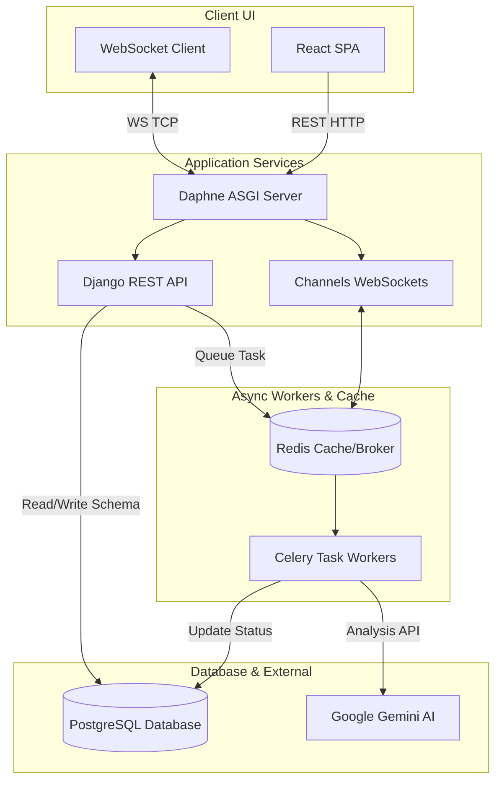

# SU Connect — System Architecture & Information System Description

This document provides a comprehensive systems-level description of **SU Connect** (Scripture Union Rwanda AI-Powered Reporting & Support System) structured under the core principles of Information Systems.

---

## 1. Purpose and Boundaries

### 1.1 Core Objective
**SU Connect** is designed to digitize and automate the operational workflows of Scripture Union Rwanda. Its main goal is to streamline activity reporting, manage support requests, track regional prayer points, and organize administrative files, using Artificial Intelligence (Google Gemini) to categorize text inputs and extract insights.

### 1.2 Boundaries
The boundaries define what lies within the control of the SU Connect system and what is external:
*   **Internal System Components**: The client-side React SPA, the Django REST backend application, the PostgreSQL relational database, the Redis message broker, the Celery async worker queue, and local media folders.
*   **External Integration Entities**:
    *   **Google Gemini API**: External LLM engine used for report categorization and RAG (Retrieval-Augmented Generation) chat querying.
    *   **SMTP Mail Gateway**: External mail transfer agent (MTA) for email notifications.
    *   **User Web Browsers**: Run the client-side code and establish TCP WebSockets connections.

### 1.3 System Environment
The broader environment includes:
*   **Deployment Networks**: Hosted cloud servers (e.g., AWS or VPS) running containerized Docker services.
*   **Regulatory & Security Compliance**: Internet connectivity guidelines in Rwanda and standard data security rules.
*   **Google API Rate Limits**: Limits on daily tokens and requests which dictate fallback behaviors.

---

## 2. The Five Components of Information Systems

### 2.2 Hardware
*   **Client Devices**: Computers, tablets, and smartphones running web browsers.
*   **Application Servers**: Hosts running the Daphne ASGI web server.
*   **Database Servers**: Dedicated database instances running PostgreSQL.
*   **Cache & Broker Servers**: Redis instances serving as Channels backend and Celery broker.
*   **Storage Buckets**: Local filesystem folders or AWS S3 cloud buckets.

### 2.2 Software
*   **Frontend SPA**: React (v18+) with Vite, Tailwind CSS or Vanilla CSS, Lucide icons, and WebSocket clients.
*   **Backend REST API**: Python (v3.10+) running Django (v6.0.5+) and Django REST Framework (v3.14.0).
*   **Real-Time Subsystem**: Django Channels (v4.0.0) with Daphne server and `channels-redis` for live notifications.
*   **Background Processing**: Celery (v5.3.6) task runners with Redis as message broker.
*   **AI Engine Interface**: Google Generative AI Python SDK (`gemini-1.5-flash`) and Pydantic for validation.
*   **Security Helpers**: `python-magic` for file signature check, `django-simple-jwt` for authentication tokens.

### 2.3 Data
The system maps persistent state in a relational database. Below is the database schema:

| Table | Primary Key | Critical Fields & Types | Relations & Description |
| :--- | :--- | :--- | :--- |
| **users** | `id` (UUID) | `email` (Unique), `password_hash`, `role` (Enum), `region`, `department`, `mfa_secret`, `notif_prefs` (JSONB) | Stores auth details, settings, and profile settings. |
| **reports** | `id` (BIGSERIAL) | `title`, `type` (Enum), `region`, `participants` (Int), `demographics` (JSONB), `description` (Text), `ai_category`, `confidence`, `ai_summary` | Stores regional activities, outcomes, and AI metadata. Ref: `submitted_by` -> `users(id)`. |
| **support_requests** | `id` (BIGSERIAL) | `type` (Enum), `title`, `description`, `priority` (Enum), `status` (Enum), `deadline` (Date) | Tracks material/personnel/financial requests. Ref: `requester` -> `users(id)`, `assigned_to` -> `users(id)`. |
| **support_comments** | `id` (BIGSERIAL) | `comment_text` (Text), `created_at` | Comments thread for support tickets. Ref: `support_request` -> `support_requests(id)`. |
| **prayer_requests** | `id` (BIGSERIAL) | `title`, `description`, `type` (Enum), `status` (Enum), `anonymous` (Bool), `responses_count` (Int) | Community prayer points. Ref: `submitted_by` -> `users(id)` (nullable). |
| **prayer_responses** | `id` (BIGSERIAL) | `message` (Text), `created_at` | Intercessors pledging support. Ref: `prayer_request` -> `prayer_requests(id)`. |
| **documents** | `id` (BIGSERIAL) | `name`, `storage_key`, `type` (Enum), `size_bytes`, `region`, `category` (Enum) | Uploaded media metadata. Ref: `uploaded_by` -> `users(id)`. |
| **notifications** | `id` (BIGSERIAL) | `type` (Enum), `title`, `message`, `is_read` (Bool) | User message queue. Ref: `user_id` -> `users(id)`. |
| **audit_logs** | `id` (BIGSERIAL) | `user_snapshot`, `action`, `resource`, `event_time`, `ip_address`, `severity` (Enum) | Immutable audit trails of mutations. Ref: `user_id` -> `users(id)`. |

### 2.4 People
The platform enforces role-based interactions using four core roles:
1.  **Administrator (`administrator`)**: Configures users, monitors compliance via Audit Logs, and manages system configurations. Requires MFA.
2.  **National Manager (`national_manager`)**: Evaluates global data, accesses analytics dashboards, overrides AI categorization if needed, and builds consolidated national reports.
3.  **Regional Coordinator (`regional_coordinator`)**: Approves, rejects, or returns activity reports submitted in their region, reviews support requests, and coordinates regional users.
4.  **Field Officer (`field_officer`)**: Enters activity drafts, submits reports, creates support tickets, and views notifications related to their assignments.

### 2.5 Processes
The system functions through predefined operational workflows:
*   **Double-Pass Report Verification**: A Field Officer submits a report -> status becomes `submitted` -> Regional Coordinator approves (state = `approved`) or returns it with comments (state = `returned`). Duties are segregated: users cannot approve their own submissions.
*   **Support Ticket Escalation**: A ticket is created -> Coordinator/Admin assigns it -> state changes to `under review` -> ticket is marked `fulfilled` or `closed` upon completion.
*   **Document Upload Guardrails**: Document uploaded -> checked against size limitations (<10MB) -> checked against extension whitelist -> validated using file signature byte magic checks.

---

## 3. Dynamics and Process Flow

The dynamics of SU Connect define how it converts inputs into actionable outputs:

```
[Inputs] ---> (Transformation Processes) ---> [Outputs]
```

*   **Inputs**:
    *   Activity descriptions, logs, numbers, and dates.
    *   Financial, training, or material support requests.
    *   Prayer items and comments.
    *   Files (PDF, Docx, JPEG).
*   **Transformation Processes**:
    *   **PII Scrubbing**: Stripping personal details (emails, phone numbers, names) from reports before sending to LLM.
    *   **AI Analysis**: Utilizing Google Gemini to parse text, select category, determine confidence level, and write summaries.
    *   **Fallback Heuristics**: If Gemini is offline, running dictionary-based regex keyword classification.
    *   **Asynchronous Processing**: Celery background queues handling emails, analysis retries, and scheduled deadline checks.
*   **Outputs**:
    *   Structured reports indexed by region and category.
    *   In-app warnings and emails (sent via SMTP).
    *   Consolidated analytics charts and monthly trend data.
    *   Real-time progress bars streamed via WebSockets.

---

## 4. System Behavior and Relationships

### 4.1 Hierarchies and Subsystems
The system is divided into functional subsystems operating in a strict logical architecture:


```mermaid
graph TD
    subgraph Client [Client UI]
        ReactUI[React SPA]
        WebSocketConn[WebSocket Client]
    end

    subgraph Service [Application Services]
        DaphneASGI[Daphne ASGI Server]
        DRF[Django REST API]
        Channels[Channels WebSockets]
    end

    subgraph Worker [Async Workers & Cache]
        Redis[(Redis Cache/Broker)]
        Celery[Celery Task Workers]
    end

    subgraph Database [Database & External]
        PostgreSQL[(PostgreSQL Database)]
        GeminiAPI[Google Gemini AI]
    end

    ReactUI -->|REST HTTP| DaphneASGI --> DRF
    WebSocketConn <-->|WS TCP| DaphneASGI --> Channels <--> Redis
    DRF -->|Queue Task| Redis --> Celery
    Celery -->|Analysis API| GeminiAPI
    Celery -->|Update Status| PostgreSQL
    DRF -->|Read/Write Schema| PostgreSQL
```

### 4.2 Interdependencies
A change in one module ripples through the system:
*   **Report Submission**: Changing a report state to `submitted` triggers a Celery worker, calls the Gemini API, increments regional dashboard statistics, updates the PostgreSQL database, and pushes a notification to Channels.
*   **Role Changes**: Changing a user's role in the database instantly modifies their REST authorization checks, API data visibility bounds, and front-end navigation layout.

### 4.3 Feedback Loops
*   **Correction Loop (User-to-AI)**: If Gemini misclassifies a report, the National Manager can manually override the category. This sets `overridden = true` in the DB, feeding back correct labels into the reports view.
*   **Review Loop (Coordinator-to-Staff)**: A Coordinator returns a report -> submitter gets an alert -> submitter corrects details and submits again, restarting the validation flow.
*   **Support Loop (Comments thread)**: Requesters and assignees comment on tickets to request clarifications, correcting course before financial/material fulfillment.

---

## 5. Management and Maintenance

### 5.1 Control Mechanisms
*   **Immutable Audit Logs**: Records all PUT, POST, PATCH, and DELETE operations, capturing user ID, timestamp, endpoint, severity (`info`, `warning`, `danger`), and caller IP.
*   **Periodic Beats**: Celery beat workers run background checks every 24 hours to flag support requests approaching deadlines and trigger email reminders.
*   **API Rate Limiting**: REST framework throttling limits logins to 5 requests per 15 minutes per IP and standard operations to 120 requests per minute.

### 5.2 Life Cycle Documentation & Endpoint Map
The system API operates under strict access rules:

| Endpoint | Method | Permitted Roles | Function |
| :--- | :---: | :--- | :--- |
| `/api/auth/login` | `POST` | Public | Obtains JWT tokens; sets HTTPOnly refresh cookie. |
| `/api/users/me` | `GET` / `PUT` | Authenticated | Configures user notification settings & details. |
| `/api/reports` | `POST` / `GET` | Authenticated | Fetches and submits reports (regional visibility bounds apply). |
| `/api/reports/:id/status` | `PATCH` | Regional Coordinator, Admin | Approves or returns a report (Segregation of Duties). |
| `/api/reports/:id/ai-override`| `PATCH` | National Manager, Admin | Manual adjustment of AI-derived category metrics. |
| `/api/support` | `POST` / `GET` | Authenticated | Submits/assigns support tickets (region-locked). |
| `/api/documents/upload` | `POST` | Authenticated | Saves documents after validation checks. |
| `/api/audit-logs` | `GET` | Admin Only | Retrieves security event history. |

### 5.3 Security and Compliance
*   **Data Protection & Access Control**: Strict RBAC rules ensure data isolation. A user from Western Province cannot query reports, files, or tickets belonging to Eastern Province.
*   **MFA Compliance**: Administrators must activate and verify their Time-based One-Time Password (TOTP/MFA) secrets before configuring database records.
*   **Idempotency Protection**: Mutating REST requests carry an `Idempotency-Key` UUID header, cached in Redis, preventing double-submitting forms.
*   **PII Sanitization**: Removes email addresses, phone numbers, and names from reports before transmission to third-party AI models.
*   **MIME Magic Check**: Prevents file extension spoofing by inspecting the binary headers of uploaded media.

---

## 6. SU Connect Role Alignment Implementation Check

The system roles must be aligned to the standard names. The status is recorded below:

*   `administrator`: Configures database, checks audit trails, activates security features.
*   `national_manager`: National scope analytics, AI overrides, consolidated reporting.
*   `regional_coordinator`: Local report approval, regional support ticket coordinator.
*   `field_officer`: Prepares activity summaries, issues support requests, files prayer entries.
