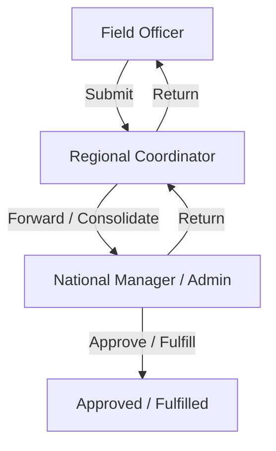

# Workflow Redesign Plan: Three-Tier Report & Support Lifecycle
This document details the architectural updates and code changes required to implement a structured, three-tier workflow for **Activity Reports** and **Support Requests** in the SU Connect system.

---

## 1. Architectural Overview & Workflow Sequence

The new flow restricts data creation and progression hierarchically:
1. **Field Officer (FO):** Creates drafts and submits them **only** to their Regional Coordinator.
2. **Regional Coordinator (RC):** 
   - Reviews reports/tickets in their region.
   - Returns them to the FO if adjustments are needed.
   - Forwards a specific report/ticket to the National Manager.
   - **Consolidates** multiple FO reports (manually or utilizing AI to generate a single draft) and submits the consolidated version to the Manager.
3. **National Manager (NM):** 
   - Reviews forwarded/consolidated reports or tickets.
   - Approves, fulfills, or returns them.

---

## 2. Report Workflow Redesign

### 2.1. Status Transitions
We will add new statuses to `STATUS_CHOICES` in `apps/reports/models.py`:
* `draft`: Initial state for Field Officers.
* `submitted_to_coordinator`: FO submits to RC. (Invisible to Managers/Admins).
* `submitted_to_manager`: RC submits/forwards to Manager/Admin.
* `approved`: Manager/Admin approves.
* `returned_by_coordinator`: RC returns to FO for correction.
* `returned_by_manager`: Manager/Admin returns to RC.

### 2.2. Query Filtering (Regional Isolation)
In `core/middleware.py` -> `RegionalQuerySet.filter_by_region`:
* **Field Officers:** Can see their own `draft` reports and any reports they submitted (`submitted_to_coordinator`, `returned_by_coordinator`, etc.).
* **Regional Coordinators:** Can see all reports in their region that are `submitted_to_coordinator`, `returned_by_coordinator`, or forwarded/consolidated.
* **National Managers / Admins:** Can see reports that are `submitted_to_manager`, `returned_by_manager`, or `approved` (regardless of region).

### 2.3. AI-Powered Report Consolidation
We will add a new API endpoint: `POST /api/reports/consolidate/`
* **Access:** Regional Coordinators only.
* **Payload:** `{ "reportIds": [1, 2, 3] }`
* **Logic:** 
  1. Retrieve selected reports (validate they belong to the coordinator's region).
  2. Call `AIService.generate_consolidated_summary(report_ids)` (which is already implemented using Gemini/Ollama in the backend!).
  3. Pre-populate a new consolidated report object (e.g. summing total participants, auto-calculating demographics, combining outcomes, and populating description/summary).
  4. Return the pre-populated report JSON.
  5. The Coordinator edits this draft in the UI and hits **"Submit to Manager"** which saves it with status `submitted_to_manager`.

---

## 3. Support Request Workflow Redesign

### 3.1. Status Transitions
We will update `STATUS_CHOICES` in `apps/support/models.py`:
* `submitted_to_coordinator`: FO submits a support ticket to RC.
* `submitted_to_manager`: RC forwards/escalates ticket to Manager.
* `approved` / `under review` / `fulfilled` / `closed`: Standard progression by Manager.
* `returned_by_coordinator`: RC returns to FO.
* `returned_by_manager`: Manager returns to RC.

### 3.2. Query Filtering (Regional Isolation)
In `core/middleware.py` -> `RegionalQuerySet.filter_by_region`:
* **Field Officers:** Can see tickets they requested.
* **Regional Coordinators:** Can see tickets in their region that are `submitted_to_coordinator` or higher.
* **National Managers / Admins:** Can see tickets that have been escalated (`submitted_to_manager`, `approved`, `fulfilled`, etc.).

### 3.3. Support Request Consolidation
We will add a new API endpoint: `POST /api/support/consolidate/`
* **Access:** Regional Coordinators only.
* **Payload:** `{ "ticketIds": [10, 11] }`
* **Logic:** 
  1. Group selected tickets by category (e.g. "Equipment" or "Financial").
  2. Combine descriptions and sum total requested values.
  3. Pre-populate a single escalated ticket to the Manager (minimizing redundant requests).

---

## 4. Step-by-Step Implementation Guide

### Phase 1: Backend Database & Business Logic
1. **Modify Models:**
   - Update `STATUS_CHOICES` in [apps/reports/models.py](file:///d:/FINAL-Project/SU-Backend/apps/reports/models.py) and [apps/support/models.py](file:///d:/FINAL-Project/SU-Backend/apps/support/models.py).
2. **Update Service Classes:**
   - Modify `ReportService` in [services/report_service.py](file:///d:/FINAL-Project/SU-Backend/services/report_service.py) to validate permissions for `submitted_to_coordinator` and `submitted_to_manager`.
   - Modify `SupportService` in [services/support_service.py](file:///d:/FINAL-Project/SU-Backend/services/support_service.py) to manage the escalated support statuses.
3. **Update Middleware Filters:**
   - Edit [core/middleware.py](file:///d:/FINAL-Project/SU-Backend/core/middleware.py) to enforce role-based status visibility.
4. **Create Consolidation Endpoints:**
   - Add consolidation API views in [apps/reports/views.py](file:///d:/FINAL-Project/SU-Backend/apps/reports/views.py) and [apps/support/views.py](file:///d:/FINAL-Project/SU-Backend/apps/support/views.py).

### Phase 2: Frontend UI Updates
1. **Field Officer Dashboard:**
   - Update forms to submit reports/tickets only to the Coordinator (assigning status `submitted_to_coordinator`).
2. **Coordinator Workspace:**
   - Add a multi-select feature to list views.
   - Add a button **"Consolidate with AI"** or **"Forward to Manager"** for selected items.
   - Trigger the consolidation API, open the report/support form pre-filled with the consolidated data, edit, and click **"Submit to Manager"**.
3. **Manager Workspace:**
   - Restrict list views to display only reports/tickets forwarded to them (`submitted_to_manager`, `approved`, etc.), and enable approval/rejection actions.
